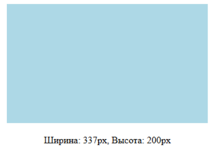

useEffect - хук, позволяющий выполнять побочные действия после того как компонент был отрисован. (паралельно).

``` js
import React, {useState, useEffect} from 'react'

const [height, setHeight] = useState(0);

useEffect(()=>{
    ...
}, [height])
```

useLayoutEffect - хук, почти такой же как useEffect, но он вызывается паралельно отрисовке.

```js
function Tooltip() {
  const ref = useRef(null)
  const [height, setHeight] = useState(0)

  useLayoutEffect(() => {
    if (ref.current) {
      const rect = ref.current.getBoundingClientRect()
      setHeight(rect.height)
    }
  }, [])

  return <div ref={ref}>Высота: {height}px</div>
}
```



Жизненный цикл компоненты???


```js
class Clock extends React.Component {
  constructor(props) {
    super(props)
    this.state = { date: new Date() }
  }

  componentDidMount() {
    this.timerId = setInterval(() => this.tick(), 1000)
  }

  componentWillUnmount() {
    clearInterval(this.timerId)
  }

  tick() {
    this.setState({ date: new Date() })
  }

  render() {
    return <div>{this.state.date.toLocaleTimeString()}</div>
  }
}
```

static getDerivedStateFromProps(): Корректирует состояние при получении новых пропсов (аналогично монтированию).
shouldComponentUpdate(nextProps, nextState): Определяет необходимость перерисовки. Возврат false отменяет рендеринг и последующие методы, что используется для оптимизации.
render(): Пересоздаёт JSX с учётом обновлённых данных.
getSnapshotBeforeUpdate(prevProps, prevState): Фиксирует состояние DOM до применения изменений (например, позицию скролла). Возвращаемое значение передается в componentDidUpdate.
componentDidUpdate(prevProps, prevState, snapshot): Вызывается после обновления DOM. Здесь выполняются действия, требующие актуального DOM (анимации, расчёты) или условные запросы к API
```js
function Clock(props) {
  const [date, setDate] = useState(new Date())

  useEffect(() => {
    const timerId = setInterval(() => setDate(new Date()), 1000)

    return () => clearInterval(timerId) // Очистка при размонтировании
  }, []) // Пустой массив — эффект запускается один раз при монтировании

  return <div>{date.toLocaleTimeString()}</div>
}
```